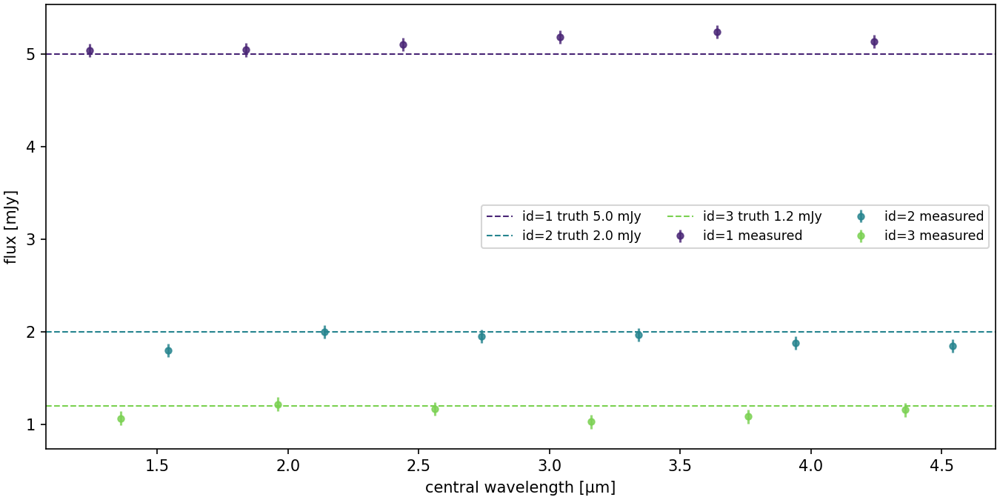
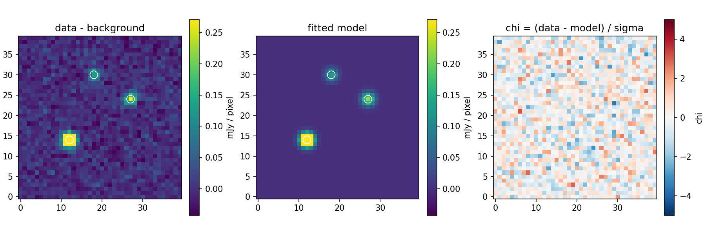

# spherex-photometry

Forced photometry and spectrophotometry from **SPHEREx L2 spectral images**.

`spherex-photometry` lets you go from a sky position to a per-source SPHEREx
spectrum on your own hardware (GPU **or** CPU): download the L2 cutouts, supply a
reference catalog, run reference-catalog forced photometry with a joint
deblending solve, and assemble the per-visit measurements into spectra. It wraps
the [`tractor-jax`](https://github.com/hbahk/tractor-jax) GPU/JAX engine and the
[`spherex-retrieval`](https://github.com/hbahk/spherex-retrieval) cutout
downloader, and packages the blind-production pipeline used for SPHEREx
deblending / photo-z work as a self-serve tool.

> **Status:** alpha. Not on PyPI yet — install from source (below). Secondary
> (channel/collapsed) catalog products and sky-simulator paths are out of scope
> until the relevant response curves / simulators are public.

## What it does

- **Reference-catalog forced photometry.** Positions and shapes come from an
  input catalog (e.g. Legacy Survey DR10) and are held fixed; the pipeline solves
  the fluxes jointly, deblending crowded SPHEREx pixels (6.15″/pixel).
- **Four estimators, one flag.** Choose the solver that matches your science
  (blind vs targeted vs regularized full-catalog) — see *Choosing a solver*.
- **Accurate low-resolution rendering.** Every source is rendered on a 5×
  oversampled grid and binned to native pixels, so the PSF × source-shape
  convolution is done at oversampled resolution.
- **GPU or CPU.** The default JAX engine runs on GPU or CPU; a separate
  `cpu-tractor` backend runs on the classic [Tractor](https://github.com/dstndstn/tractor)
  for JAX-free environments.
- **Spectra out.** One spectrophotometric point per source per visit, assembled
  into per-source spectra (sorted by wavelength, inverse-variance binned).

Fluxes are in **mJy**; magnitudes are AB.

## Install

`spherex-photometry` depends on two packages that are not yet on PyPI, so install
them from source first:

```bash
pip install git+https://github.com/hbahk/tractor-jax        # engine (CPU jax)
pip install git+https://github.com/hbahk/spherex-retrieval  # L2 cutout downloader
pip install git+https://github.com/hbahk/spherex-photometry # this package
```

Optional extras:

```bash
pip install "spherex-photometry[gpu]"      # CUDA 12 jax build (GPU)
pip install "spherex-photometry[catalog]"  # NOIRLab Data Lab (Legacy Survey fetcher)
pip install "spherex-photometry[plot]"     # matplotlib for spectrum plots
```

The optional **CPU-only `cpu-tractor` backend** additionally needs the upstream
Tractor (not on PyPI):

```bash
pip install git+https://github.com/dstndstn/tractor
```

CPU-only users generally do **not** need this: the default JAX engine runs on CPU
(`device="cpu"`) with the same accurate rendering. See *CPU backend* in the docs.

## Quick start

```python
from spherex_photometry import PhotometryConfig, run_photometry, build_spectra, retrieve
from astropy.coordinates import SkyCoord
import astropy.units as u

# 1. Download L2 cutouts around a target (spherex-retrieval)
retrieve(SkyCoord(150.0*u.deg, 2.0*u.deg), 100, output_dir="cutouts",
         include_wavelength=True, include_sapm=True)

# 2. Bring a reference catalog (or fetch Legacy Survey DR10):
from spherex_photometry import fetch_ls_dr10
fetch_ls_dr10(150.0, 2.0, out="catalog.parquet")     # needs [catalog] extra

# 3. Run forced photometry (blind-production default: eigfloor)
cfg = PhotometryConfig(solver="eigfloor")
phot = run_photometry("cutouts", "catalog.parquet", cfg, output="phot.parquet")

# 4. Assemble per-source spectra
spectra = build_spectra(phot)     # {id: table sorted by central_wavelength}
```

Or from the command line:

```bash
spherex-phot retrieve --ra 150.0 --dec 2.0 --out cutouts
spherex-phot fetch-catalog --ra 150.0 --dec 2.0 --out catalog.parquet
spherex-phot run --cutouts-dir cutouts --catalog catalog.parquet \
    --solver eigfloor --output phot.parquet
spherex-phot spectra --photometry phot.parquet --all --plot spec
```

## Try it offline (no data, no network, no GPU)

```bash
python examples/03_offline_demo.py
```

Simulates a small field with sources of known flux, photometers it, and writes
two figures — the fit and the recovered spectra against the injected truth:



`spherex_photometry.diagnostics.plot_fit` gives the data / model / chi view of
any cutout so you can see what the solver did:



Walkthrough: the *Worked example* page in the docs.

### Sharing a GPU

JAX preallocates most of the card by default. When sharing a GPU, set:

```python
PhotometryConfig(gpu_preallocate=False, gpu_mem_fraction=0.45)
```

## Choosing a solver (short version)

| solver | use it for | keeps negatives | notes |
|---|---|---|---|
| `eigfloor` *(default)* | **blind** photometry / photo-z | yes | calibrated errors |
| `lasso` | **targeted** bright sources | no | best σ at S/N 3–30; under-covering posteriors |
| `eigfloor_prior` | **regularized full-catalog** | yes (protected) | SED priors on faint nuisances |
| `linear` | sparse fields / shallow catalogs | yes | degenerate at full LS depth |

See the docs' *Choosing a solver* page for the full trade-offs. The `cpu-tractor`
backend supports `linear` only, but solves **per tile** on the same grid as the
GPU path, which keeps `linear` well conditioned even at full catalog depth.

## Documentation

Full docs (installation, quickstart, solver guide, hardware/GPU sizing, data
model, systematics, CPU backend, configuration reference):
<https://spherex-photometry.readthedocs.io>.

## License

GPL-3.0-or-later (it links the GPL `tractor-jax` engine). The optional upstream
`tractor` is GPLv2 and is used only as an optional, user-installed runtime
dependency.
